# Hi there! 👋

Welcome to my GitHub profile! 

Here is my dynamically generated Flappy Bird animated banner:

<picture>
  <source media="(prefers-color-scheme: dark)" srcset="flappy-bird.svg">
  <source media="(prefers-color-scheme: light)" srcset="flappy-bird.svg">
  
</picture>

---

### How this works

This repository contains a Node.js script located at `generate.js` that compiles base64 encoded images of Flappy Bird assets into an animating SVG. A GitHub Action automatically runs to regenerate this `flappy-bird.svg` file, keeping the profile fresh and active!
